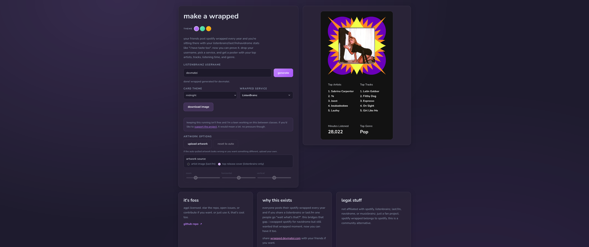

# 🎧 Make a Wrapped

Spotify Wrapped-style recap generator for ListenBrainz, Last.fm, and Navidrome. Built with Flask.

> [!IMPORTANT]
> Rebranded to Make a Wrapped (was ListenBrainz Wrapped).
> Site's back up. if something's broken, open a [GitHub issue](https://github.com/DevMatei/make-a-wrapped/issues/new/choose).
>
> New 2025 templates are out!



## 🌐 website

[wrapped.devmatei.com](https://wrapped.devmatei.com/) - built by [devmatei.com](https://devmatei.com)

## 💡 why it's cool

* pulls from ListenBrainz, Last.fm, Navidrome, MusicBrainz, Cover Art Archive, and Wikidata. all public, no tokens needed (except the optional Last.fm key you'd already have for artwork anyway)
* artist art tries Last.fm first, falls back to MusicBrainz/Wikidata, and if all else fails there's a built-in editor to upload/zoom/position your own image (saved in local storage, or temporarily on the server for 1 hour)
* rate limits are in so your server doesn't get nuked
* there's a live counter of total wraps ever generated (idk it seemed cool)
* officially listed on the [ListenBrainz Enabled Applications](https://wiki.musicbrainz.org/ListenBrainz_Enabled_Applications) page :D

## 🏷️ readme badges

put your top artist in your github profile / website. live shields-style SVG, cached server-side so it won't nuke anything:

```markdown

```

options via query params:

* `type` - `artist` (default), `track`, `genre`, `minutes`
* `service` - `listenbrainz` (default) or `lastfm`
* `range` - any period preset, e.g. `this_month`, `this_year`, `all_time`
* `color` - hex without the `#`, e.g. `color=ff6b9d`

```markdown

```

**navidrome badges** work differently since your server credentials never touch this app: generate your wrapped, hit "copy readme badge", and the browser publishes just the final numbers (top artist/track/genre/minutes, nothing else) under a private key stored in your browser. the badge URL stays stable across regenerations, only you can update it, and snapshots expire after 60 days unless refreshed.

## wanna make me slightly richer? (i'm broke lol)

[](https://ko-fi.com/F1F016B4WM)

## ⚡ quickstart

```bash
python3 -m venv .venv && source .venv/bin/activate
pip install -r requirements.txt
```

copy `.env.example` to `.env` and fill in the basics:

```
FLASK_ENV=production
SECRET_KEY=<something>
LASTFM_API_KEY=<your-lastfm-key>
# set HTTP_PROXY / HTTPS_PROXY if you tunnel through a proxy
```

run it:

```bash
gunicorn -w 4 -b 0.0.0.0:8000 wrapped-fm:app
```

or locally:

```bash
./start.sh <host> <port>
```

or with Docker (change the port in the compose file first):

```bash
sudo docker compose up -d
```

## ⚙️ config

### core

`LISTENBRAINZ_API=https://api.listenbrainz.org/1`
`MUSICBRAINZ_API`, `COVER_ART_API`
`LISTENBRAINZ_RANGE=this_year`
`AVERAGE_TRACK_LENGTH_MINUTES`, `COVER_ART_LOOKUP_LIMIT`

### integrations

`LASTFM_API_KEY` - required for Last.fm stats + better artist images
`LASTFM_API`, `LASTFM_USER_AGENT`

### performance

`HTTP_TIMEOUT`, `HTTP_POOL_MAXSIZE`, `LISTENBRAINZ_CACHE_TTL`, `LISTENBRAINZ_CACHE_SIZE`
`APP_RATE_LIMIT`, `APP_STATS_RATE_LIMIT`, `APP_IMAGE_RATE_LIMIT`, `APP_MAX_TOP_RESULTS`
`APP_IMAGE_CONCURRENCY`, `APP_IMAGE_QUEUE_LIMIT`, `APP_IMAGE_QUEUE_TIMEOUT`
`TEMP_ARTWORK_TTL_SECONDS`, `TEMP_ARTWORK_MAX_BYTES`
`WRAPPED_COUNT_FILE` (defaults to `data/wrapped-count.txt`)
`WRAPPED_COUNT_SINCE` - label for when you started counting wraps (ISO date string)
`APP_RATE_LIMIT_SALT`, `APP_TRUST_PROXY_HEADERS`
`BADGE_CACHE_TTL` (seconds, default 6h), `BADGE_CACHE_SIZE`
`BADGE_SNAPSHOT_DIR`, `BADGE_SNAPSHOT_TTL_SECONDS` (default 60 days), `BADGE_SNAPSHOT_MAX_COUNT`

### why it exists

I self-host my music library on Navidrome and don't use Spotify, but all my friends post their Wrapped every year and everyone's like "wait what's that?" when you show them a ListenBrainz stats page. so I built this. same vibe, works with open music platforms.

go flex your scrobbles at [wrapped.devmatei.com](https://wrapped.devmatei.com) :)

### about me

I'm Matei ([DevMatei](https://devmatei.com)) - full-stack dev from Moldova. I build random web tools, run a homelab full of self-hosted stuff, and care way too much about my music library. Check out my other projects at [devmatei.com](https://devmatei.com) or hit me up on socials if you wanna talk projects or self-hosting.

## 🤝 contributing

See [CONTRIBUTING.md](./.github/CONTRIBUTING.md) for setup, style notes, and the PR checklist. TL;DR: keep PRs focused, run `python -m py_compile wrapped-fm.py`, and attach screenshots for any UI changes.

## 🧩 to-do

* [x] security improvements
* [x] faster rendering (capped around 33s by API speeds, not much I can do)
* [x] modular, readable code (kind of)

originally made for Last.fm only by [jeff parla](https://github.com/parlajatwit) <3

## star history

<a href="https://www.star-history.com/?repos=devmatei%2Fmake-a-wrapped&type=date&legend=top-left">
 <picture>
   <source media="(prefers-color-scheme: dark)" srcset="https://api.star-history.com/chart?repos=devmatei/make-a-wrapped&type=date&theme=dark&legend=top-left&sealed_token=hqKtGOCKpuhqdJ4EGwzj7IO3Br7w8APo1cS5gbEa2Qjc09c7d_5G0LbhnmPzV7xYM1VVayE0IifWD_IUBifA5HSAdm33mKRu8nmp43tqSyUbOshG1oHCug" />
   <source media="(prefers-color-scheme: light)" srcset="https://api.star-history.com/chart?repos=devmatei/make-a-wrapped&type=date&legend=top-left&sealed_token=hqKtGOCKpuhqdJ4EGwzj7IO3Br7w8APo1cS5gbEa2Qjc09c7d_5G0LbhnmPzV7xYM1VVayE0IifWD_IUBifA5HSAdm33mKRu8nmp43tqSyUbOshG1oHCug" />
   
 </picture>
</a>

## 📜 license

AGPL-3.0 - share alike

not affiliated with Spotify, ListenBrainz, Last.fm, Navidrome, or MusicBrainz. just a fan thing built for fun.